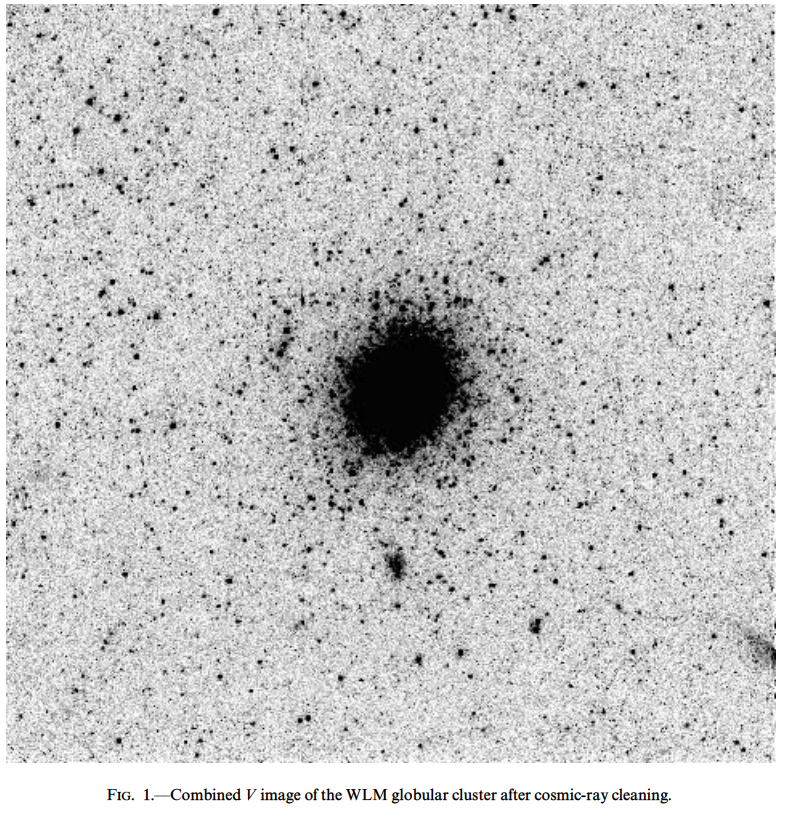

# WLM-GC

Photometric analysis of the WLM-GC globular cluster located in the [WLM galaxy](https://en.wikipedia.org/wiki/Wolf%E2%80%93Lundmark%E2%80%93Melotte).
The photometric data used in the analysis comes from the [Hodge et al. (1999)](http://adsabs.harvard.edu/abs/1999ApJ...521..577H) article, and corresponds to observations in the `V,I` filters.


**Fig 1 from *Hodge et al (1999).***


## Processed data

Hodge et al. comment about this data:

> "*For the color-magnitude diagram (CMD) and luminosity function analyses below, roughly the central 20% of the image was analyzed to maximize the signal from the globular while minimizing the background star contamination. In that region, the effect of background stars is negligible.*"

Because of this the entire frame was processed as part of the GC, with no membership analysis applied.

There is also an analysis of the custer in [Larsen et al. (2014)](https://www.aanda.org/articles/aa/abs/2014/05/aa22672-13/aa22672-13.html).


## Structural analysis

The center of the cluster is `(0:01:49.48, -15:27:30.7), (0.4561667, -15.4585277) deg` in J2000.0 according to [Billet et al. (2001)](http://iopscience.iop.org/article/10.1086/339181/fulltext/). See the GC at [Aladin](http://aladin.unistra.fr/AladinLite/?target=00+01+49.480-15+27+30.70&fov=0.10&survey=P%2FDSS2%2Fcolor).

The cluster's radii are (using the scale 0.045 arcsec/pixel for [HST-WFC3 (UVIS)](http://www.stsci.edu/hst/wfc3/ins_performance/detectors) observations):

    r_c=1.09'' (~24 px)
    r_t=31''   (~690 px)
    
according to Hodge et al.

We used the entire frame as the cluster region, ie: `r_cl~200 px`.


## Fundamental parameters in literature

According to Hodge et al., its fundamental parameters are:

> "*A best fit to theoretical isochrones indicates that this cluster has a metallicity of [Fe/H]=-1.52+-0.08 and an age of 14.8+-0.6 Gyr, thus indicating that it is similar to normal old halo globulars in our Galaxy. From the fit we also find that the distance modulus of the cluster is 24.73+-0.07 and the extinction is AV=0.07+-0.06.*"

The logarithmic age is thus ~10.17, and the metallicity z~0.00046 (using z_0=0.0152).


## Analyis with ASteCA

The binary fraction was fixed to 0. as the quality of the photometry is not enough to fit this parameter. The entire frame was assumed to be composed of cluster stars  (ie: no decontamination process was attempted), and I imposed a maximum magnitude cut at 26.5 to minimize the photometric incompleteness effect. About this Hodge et al says:

> "*The cutoff magnitudes of 27 in V and 26 in I were chosen to minimize the corrections required due to incompleteness*"


### Limited E_BV<0.05

The five fitted parameters were given ranges as follows:


```
Param      min     max
----------------------
z       0.0001  0.0028
log(a)     9.8    10.2
E(BV)       .0     .05
dm         24.    25.5
M       400000  700000
```

The analysis with these limits gives the following parameter estimates:

```
Param      Mean     MAP     Median     Mode     16th     84th     stddev
------------------------------------------------------------------------
z       0.00014 0.00014    0.00014  0.00013  0.00012   0.00015   0.00004
log(a)    10.01   9.943      10.01    9.949    9.943     10.12   0.07767
E(BV)    0.0401  0.0472     0.0472   0.0465   0.0284    0.0476    0.0132
dm       25.077   25.09      25.09   25.088   25.022    25.101   0.08315
M       4.3e+05   4e+05   4.06e+05 4.06e+05  4.0e+05  4.76e+05  5.14e+04
```

The output images are stored in the output folder `E_BV_005`.


### Limited E_BV<0.2

The analysis with the same limits given above except `E_BV_max = 0.2`, gives the following parameter estimates:

```
Param      Mean     MAP     Median     Mode     16th     84th     stddev
------------------------------------------------------------------------
z       0.00012 0.00012    0.00012  0.00011  0.00011   0.00014   0.00003
log(a)    10.02   10.01      10.01    10.01    10.01     10.04   0.03959
E(BV)     0.073   0.119     0.0743    0.116   0.0172     0.119    0.0431
dm       24.974  24.818     24.932   24.836   24.818     25.16   0.16743
M       4.7e+05 4.9e+05    4.9e+05   4.9e+05 4.2e+05   4.9e+05   4.6e+04
```

The output images are stored in the output folder `E_BV_02`.
